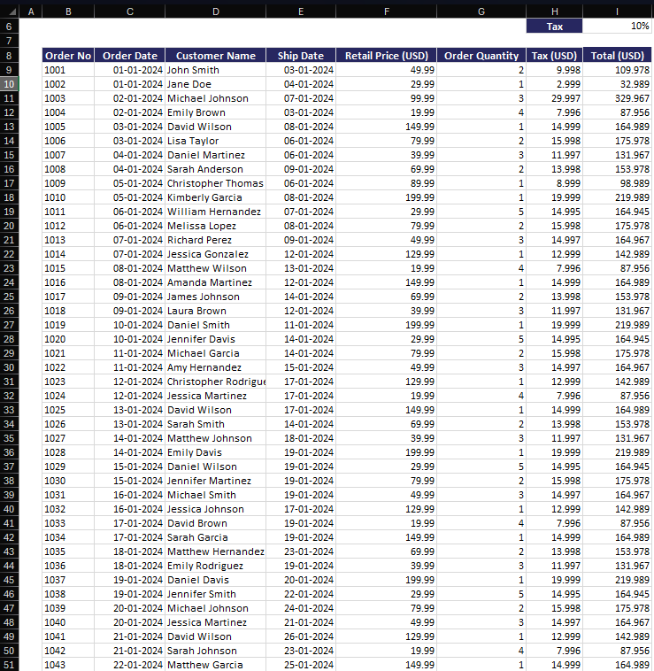
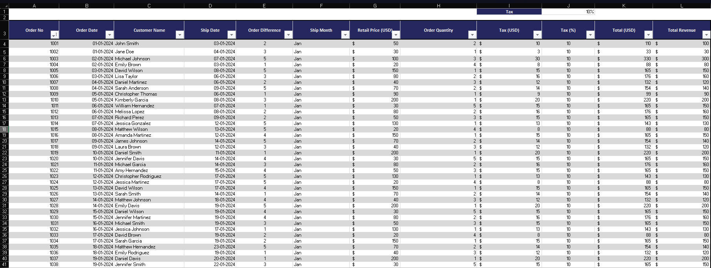
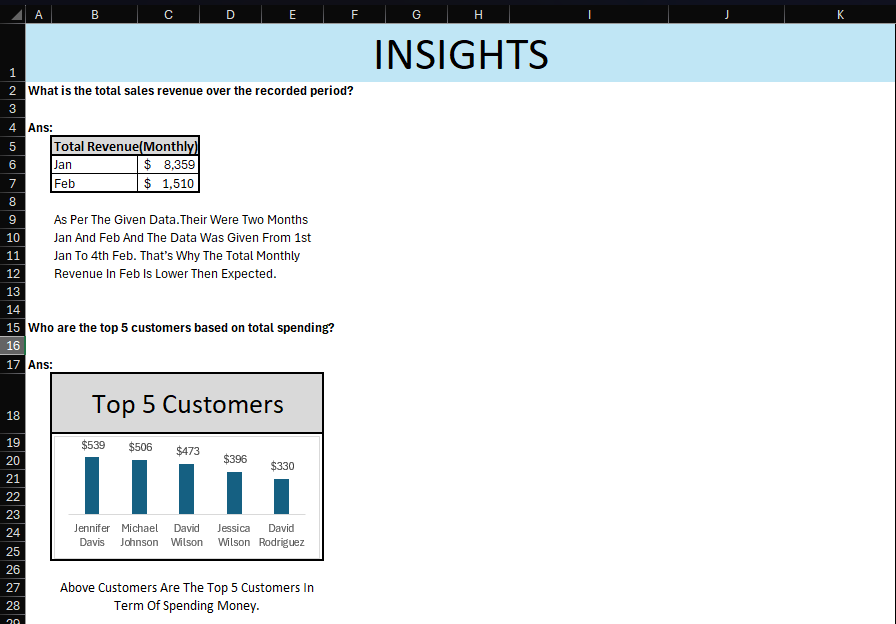

# Supermarket Sales Report

## 📌 Project Overview
This project analyzes supermarket sales data to gain insights into revenue, customer spending patterns, order trends, and tax contributions. The dataset contains information on order details, customer names, retail prices, tax amounts, and revenue.

## 📂 Project Structure
```
Supermarket_Sales_Report/
│-- Final Data/         # Contains the cleaned and processed dataset
│-- Raw Data/           # Contains the original dataset
│-- Screenshots/        # Contains raw data and final data screenshots
│-- README.md           # Project documentation
```
## 📷 Screenshots

Screenshots of **Raw Data** and **Final Data** are included in the `Screenshots/` folder for reference.

Here are some previews of the raw and final data:

### Raw Data Sample


### Final Data Sample


## 📊 Key Analytical Questions & Findings
1. **Total Sales Revenue**: The total sales revenue is calculated from the 'Total' column.
2. **Top 5 Customers by Spending**: A pivot table is used to determine the highest-spending customers.
3. **Average Order Value**: Computed as total revenue divided by the number of orders.
4. **Sales Trends Across Months**: Sales data is analyzed to identify trends in different months.
5. **Average Time Between Order and Ship Date**: The time difference between order and ship date is computed.
6. **Trends in Tax Amounts**: Tax percentages and amounts are analyzed to identify patterns.

## 🛠 Data Processing Steps
### **Data Cleaning**
- Removed duplicates and null values.
- Standardized order numbers.

### **Data Transformation & Calculations**
- **Total Revenue:** Aggregated total from the 'Total' column.
- **Ship Month:** Extracted month from the 'Ship Date' column.
- **Top 5 Customers:** Created a pivot table and bar chart.
- **Average Order Value:** Used the AVERAGE function and manual calculation.
- **Sales Trends:** Created a pivot table and pie chart.
- **Order Difference:** Calculated as 'Ship Date - Order Date'.
- **Tax Percentage:** Added a new column for tax percentage calculation.

### **Insights & Visualization**
All findings are consolidated in the **Insights** sheet, containing relevant charts and calculations.

### Insights of Sample


## 🚀 How to Use This Report
1. Download the final **Supermarket_Sales_Report.xlsx** file from final data.
2. Explore different sheets containing analysis and visualizations.
3. Use pivot tables and charts to filter and analyze data further.

## 📢 Contributing
If you have suggestions or improvements, feel free to fork the repository and submit a pull request!

## 📜 License
This project is for educational purposes and is open for learning and analysis.

---
**Author:** Sanjeev Yadav  
📧 Contact: sanjeevyadav4696@gmail.com